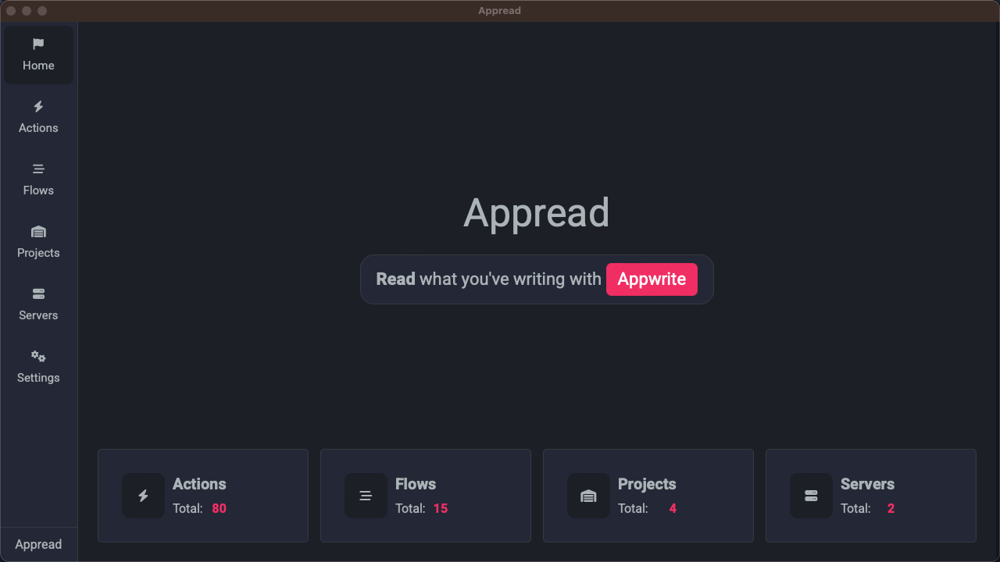

# Appread



## All-in-one Appwrite SDKs tester

## Add locale

To add locale follow these steps. will demonstrate on Spanish.

1. Make a copy of [en.json](./src/locale/locales/en.json) in the same folder and name it `es.json`.
2. Translate all the strings to Spanish.
   3.Import the newly created JSON file inside the of the [Locale.ts](./src/locale/Locale.ts) class.

```typescript
import es from './locales/es.json';
```

4. Now, Add constant for the local on the top

```ts
const LOCALE_ES = 'es';
```

5. Add the local to the `availableLocales` object:

```ts
   availableLocales: Record<string, SingleLocale> = {
    [LOCALE_EN]: new SingleLocale(LOCALE_EN, 'English', en),
    [LOCALE_ES]: new SingleLocale(LOCALE_ES, 'Español', es)
}
```
That's it.